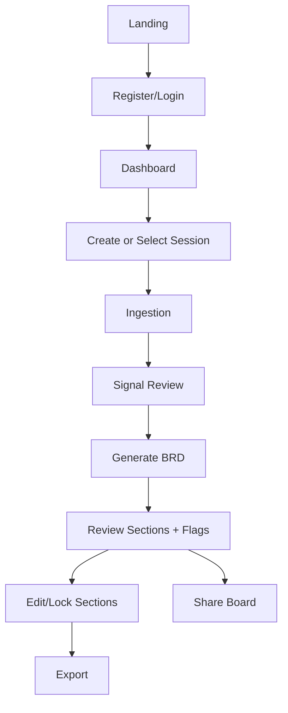
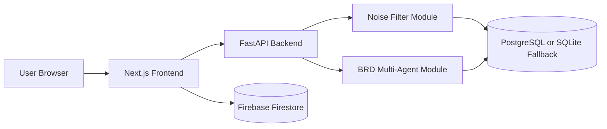
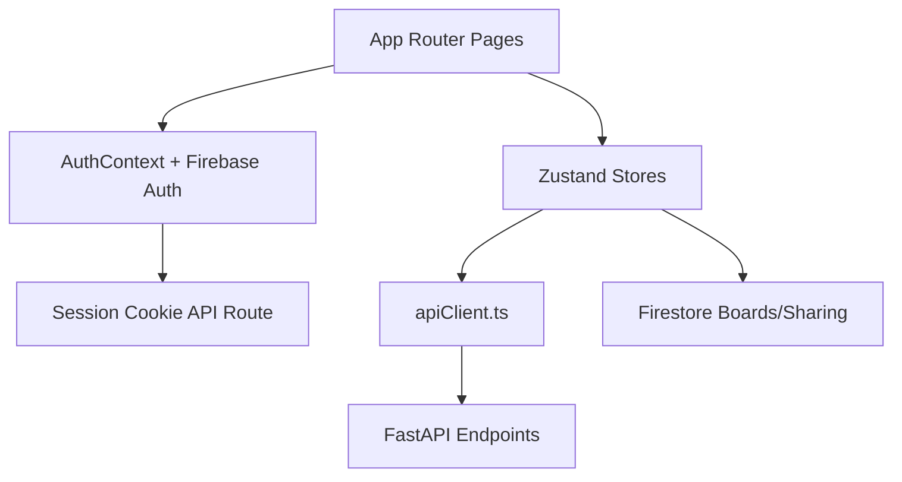
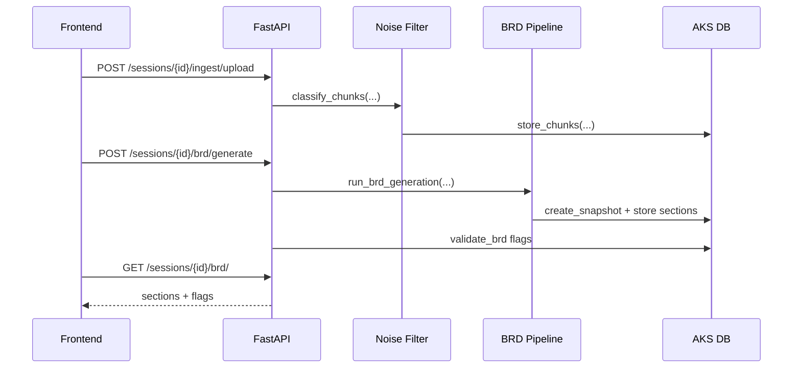
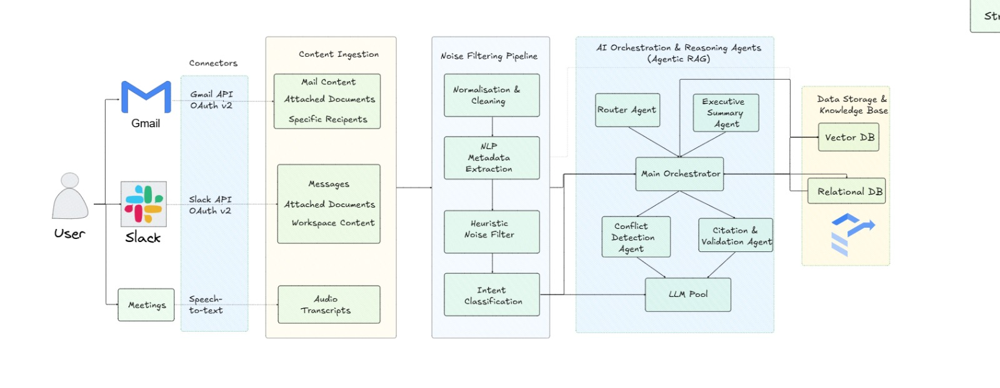
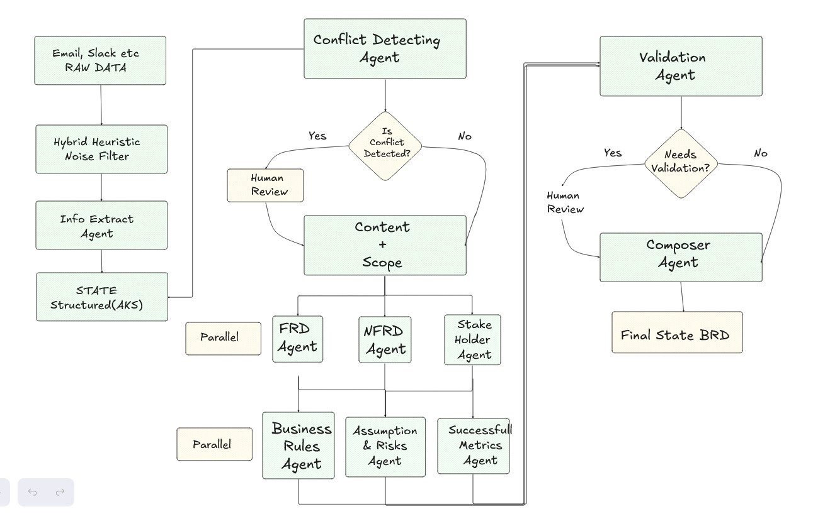

# Beacon

Comprehensive root-level documentation for the full Beacon project.

Beacon is an AI-assisted Business Requirements Document platform that converts scattered project conversations and documents into structured BRD drafts with review and export workflows.

## Live Link

[](https://brd-agent-xi.vercel.app/)
[](https://github.com/simplysandeepp/Beacon)
[](CONTRIBUTING.md)

## Technology Stack Buttons


## Quick Links

- Live app: https://brd-agent-xi.vercel.app/
- Repository: https://github.com/simplysandeepp/Beacon
- Contributing guide: [CONTRIBUTING.md](CONTRIBUTING.md)
- Frontend README: [frontend/README.md](frontend/README.md)
- Backend setup reference: [backend/SETUP.md](backend/SETUP.md)
- BRD module API notes: [backend/brd_module/API.md](backend/brd_module/API.md)

## Team

| Name | Role | GitHub ID |
| --- | --- | --- |
| Sandeep Prajapati | Team Member | [@simplysandeepp](https://github.com/simplysandeepp) |
| Kurian Jose | Team Member | [@KurianJose7586](https://github.com/KurianJose7586/) |
| Preet Biswas | Team Member | [@preetbiswas12](https://github.com/preetbiswas12) |
| Aryan Singh | Team Member | [@DevAryanSin](https://github.com/DevAryanSin) |

## Table Of Contents

1. [Project Summary](#project-summary)
2. [What Problem Beacon Solves](#what-problem-beacon-solves)
3. [Core Capabilities](#core-capabilities)
4. [User Flow](#user-flow)
5. [Architecture Flow](#architecture-flow)
6. [Detailed Processing Pipeline](#detailed-processing-pipeline)
7. [Data Model And Persistence](#data-model-and-persistence)
8. [Backend API Reference](#backend-api-reference)
9. [Integration Module Endpoints](#integration-module-endpoints)
10. [Frontend Route Map](#frontend-route-map)
11. [Tech Stack](#tech-stack)
12. [Repository Structure](#repository-structure)
13. [Local Setup And Run](#local-setup-and-run)
14. [Environment Variables](#environment-variables)
15. [Deployment Notes](#deployment-notes)
16. [Contributing](#contributing)
17. [Testing](#testing)
18. [Known Gaps And Practical Notes](#known-gaps-and-practical-notes)
19. [Screenshots Gallery](#screenshots-gallery)
20. [Social Handles](#social-handle)

## Project Summary

Beacon is a full-stack application with:

- A Next.js frontend for authentication, session management, source ingestion, signal review, BRD drafting, collaboration, and export.
- A FastAPI backend for ingestion endpoints, chunk review, BRD generation, validation, and export.
- A noise-filter engine that combines heuristics and LLM classification.
- A multi-agent BRD generation pipeline that writes sectioned output and validation flags.
- Firestore-based collaboration objects (boards, members, invite links) for team sharing.

## What Problem Beacon Solves

Teams usually capture requirements in multiple places:

- Slack threads
- Email conversations
- Meeting notes
- Uploaded files

This creates issues:

- Important decisions are hard to trace.
- Requirements conflict across sources.
- BRD writing is slow and repetitive.
- Ownership and review state become unclear.

Beacon addresses this through a defined pipeline:

1. Ingest source data.
2. Classify and suppress noise transparently.
3. Store attributed signals.
4. Generate multi-section BRD drafts.
5. Validate contradictions/gaps.
6. Enable human edits and export.
7. Support collaborative board sharing.

## Core Capabilities

### Product Features

- Authenticated workspace with protected routes.
- Session-oriented workflow for BRD runs.
- Source ingestion from uploaded files and demo dataset.
- Signal review with active/suppressed states and restore action.
- BRD generation across seven sections.
- Validation flag surfacing.
- Human section editing and lock behavior.
- Export in Markdown, HTML, and DOCX from backend.
- Share links and role-based board access via invites.

### BRD Section Coverage

Current generation pipeline produces:

1. Executive Summary
2. Functional Requirements
3. Stakeholder Analysis
4. Timeline
5. Decisions
6. Assumptions
7. Success Metrics

## User Flow

### Step-By-Step Journey

1. User opens the app and signs up/logs in.
2. Frontend creates a middleware session cookie (`firebase-session`) and loads user boards/sessions.
3. User creates or selects a BRD session.
4. User ingests data using file upload or demo ingestion.
5. Backend classifies chunks and stores active/suppressed entries.
6. User reviews signals and optionally restores suppressed items.
7. User triggers BRD generation.
8. Backend snapshots current signals, runs section agents, validates output.
9. User reviews section cards, validation flags, and edits content if needed.
10. User exports BRD (`.md`, `.html`, `.docx`) and can share board access with teammates.

### User Flow Diagram



## Architecture Flow

### High-Level Architecture



### Runtime Responsibility Split

- `frontend/` handles UI, route protection, auth UX, state management, collaboration UX.
- `backend/` handles classification orchestration, BRD generation, validation, and exports.
- Firestore handles board membership and invite workflows.
- AKS data (chunks/snapshots/sections/flags) is persisted in PostgreSQL or SQLite fallback.

### Frontend Architecture Flow



### Backend Request Flow



### Provided Flowchart Diagrams

#### Multi-Agent Pipeline Flowchart



#### Website Architecture Flowchart



## Detailed Processing Pipeline

### 1) Session Creation

- Endpoint: `POST /sessions/`
- Returns UUID `session_id`.
- Session ID is the correlation key for chunks, snapshots, and BRD outputs.

### 2) Ingestion

- JSON ingestion endpoint: `POST /sessions/{session_id}/ingest/data`
- File upload endpoint: `POST /sessions/{session_id}/ingest/upload`
- Demo dataset endpoint: `POST /sessions/{session_id}/ingest/demo`

Notes:

- Upload endpoint currently supports demo mode behavior that copies pre-classified cache when available.
- Demo endpoint supports streaming style logs on backend.

### 3) Noise Filtering And Signal Extraction

Classification path in `backend/Noise filter module/classifier.py`:

1. Heuristic pass (regex and pattern rules)
2. Domain gate
3. LLM batch classification for unresolved chunks

Confidence handling (current code path):

- `>= 0.90`: auto-accept
- `0.70 to 0.89`: accept but flag for review
- `< 0.70`: force to noise and flag for review

Labels:

- `requirement`
- `decision`
- `stakeholder_feedback`
- `timeline_reference`
- `noise`

### 4) Attributed Knowledge Store (AKS)

Stored entities include:

- classified chunks
- snapshots of chunk IDs for frozen generation context
- BRD section versions
- validation flags

### 5) BRD Generation Pipeline

Orchestrator: `backend/brd_module/brd_pipeline.py`

Flow:

1. Create snapshot of current active signals.
2. Run six section agents in parallel worker pool.
3. Run executive summary agent after other sections.
4. Store each section as a versioned entry.
5. Trigger validation.

### 6) Validation

Validator: `backend/brd_module/validator.py`

Checks:

- Rule-based gap detection for sections with "Insufficient data".
- AI semantic contradiction check between requirements and decisions.

Flags stored in `brd_validation_flags` with severity.

### 7) Human-In-The-Loop Editing

- Section edit endpoint: `PUT /sessions/{session_id}/brd/sections/{section_name}`
- Ad-hoc prompt endpoint: `POST /sessions/{session_id}/hitl/prompt`
- Version ledger helpers in `backend/brd_module/hitl/versioned_ledger.py`

### 8) Export

Endpoint: `GET /sessions/{session_id}/brd/export?format=...`

Supported formats:

- `markdown`
- `html`
- `docx`

Internals:

- Markdown compilation from latest sections.
- HTML uses markdown-to-html conversion plus embedded styles.
- DOCX uses template fill if `brd.docx` exists, otherwise generates from scratch.

## Data Model And Persistence

### Backend AKS Tables (Created In `storage.py`)

- `classified_chunks`
- `brd_snapshots`
- `brd_sections`
- `brd_validation_flags`

### Frontend Collaboration Data (Firestore)

Collections/subcollections used by frontend:

- `boards/{boardId}`
- `boards/{boardId}/members/{uid}`
- `users/{uid}/boards/{boardId}`
- `invites/{token}`

### Persistence Strategy Summary

- BRD processing data: PostgreSQL by default, SQLite fallback.
- User auth and collaboration metadata: Firebase Auth + Firestore.

## Backend API Reference

Base: FastAPI app in `backend/api/main.py`

### Session Endpoints

| Method | Path | Purpose |
| --- | --- | --- |
| POST | `/sessions/` | Create new session ID |
| GET | `/sessions/{session_id}` | Get session status |

### Ingestion Endpoints

| Method | Path | Purpose |
| --- | --- | --- |
| POST | `/sessions/{session_id}/ingest/data` | Ingest raw JSON chunks |
| POST | `/sessions/{session_id}/ingest/upload` | Upload and process file |
| POST | `/sessions/{session_id}/ingest/demo` | Demo ingestion from dataset |

### Review Endpoints

| Method | Path | Purpose |
| --- | --- | --- |
| GET | `/sessions/{session_id}/chunks/?status=signal|noise|all` | List chunks by state |
| POST | `/sessions/{session_id}/chunks/{chunk_id}/restore` | Restore suppressed chunk |

### BRD Endpoints

| Method | Path | Purpose |
| --- | --- | --- |
| POST | `/sessions/{session_id}/brd/generate` | Generate BRD + validation |
| GET | `/sessions/{session_id}/brd/?format=markdown|html` | Fetch sections + flags |
| PUT | `/sessions/{session_id}/brd/sections/{section_name}` | Save human-edited section |
| GET | `/sessions/{session_id}/brd/export?format=markdown|html|docx` | Download compiled BRD |

### HITL Endpoints

| Method | Path | Purpose |
| --- | --- | --- |
| POST | `/sessions/{session_id}/hitl/prompt` | Parse/apply natural-language edit |
| GET | `/sessions/{session_id}/hitl/status` | HITL status |
| POST | `/sessions/{session_id}/hitl/start` | Start HITL round (stub) |
| GET | `/sessions/{session_id}/hitl/questions` | Retrieve questions (stub) |
| POST | `/sessions/{session_id}/hitl/answers` | Submit answers (stub) |
| PUT | `/sessions/{session_id}/hitl/requirements` | Requirement edit endpoint (stub) |

## Integration Module Endpoints

Integration module app is in `backend/Integration Module/`.

### Gmail Routes

- `GET /gmail/login`
- `GET /gmail/oauth_redirect`
- `GET /gmail/check`
- `GET /gmail/search`
- `GET /gmail/download/{message_id}/{attachment_id}`
- `GET /gmail/extract_batch`
- `POST /gmail/process_selected`

### Slack Routes

- `GET /slack/login`
- `GET /slack/oauth_redirect`
- `GET /slack/messages`
- `GET /slack/channels`
- `GET /slack/post`
- `POST /slack/process_selected`

### PDF Route

- `POST /pdf/parse`

## Frontend Route Map

Primary app pages in `frontend/src/app/`:

- `/` - Landing page
- `/login` - Login
- `/register` - Registration
- `/forgot-password` - Password reset
- `/dashboard` - Session dashboard
- `/ingestion` - Source ingestion UI
- `/signals` - Signal review
- `/brd` - BRD section review and generation
- `/brd/new` - New BRD flow
- `/editor` - Alternate BRD editor UI
- `/export` - Export page
- `/settings` - Settings and session management
- `/profile` - Profile and integration controls
- `/analytics/conflicts` - Conflict analytics view
- `/analytics/traceability` - Traceability matrix view
- `/analytics/sentiment` - Sentiment analytics view
- `/agents` - Agent page
- `/templates` - Template page
- `/project/new` - New project page
- `/project/[id]` - Project workspace tabs
- `/invite/[token]` - Shared board invite acceptance

## Tech Stack

### Frontend

- Next.js 14 (App Router)
- React 18
- TypeScript
- Tailwind CSS
- Zustand
- Framer Motion
- Firebase Auth + Firestore SDK

### Backend

- Python
- FastAPI + Uvicorn
- Groq SDK
- Pydantic
- psycopg2
- SQLite fallback

### Export And Document Processing

- Markdown conversion
- WeasyPrint (PDF capable path)
- python-docx (DOCX template fill and generation)

### External Integrations

- Slack SDK/OAuth
- Google OAuth + Gmail API

## Repository Structure

```text
Beacon/
  README.md
  backend/
    api/
    brd_module/
    Noise filter module/
    Integration Module/
    requirements.txt
    SETUP.md
  frontend/
    src/
    assets/
    apiClient and stores
    CONTRIBUTING.md
    package.json
```

## Local Setup And Run

### Prerequisites

- Node.js 18+
- npm
- Python 3.9+
- Optional PostgreSQL (or use SQLite fallback)
- Firebase project for auth/collaboration features

### 1) Clone

```bash
git clone https://github.com/simplysandeepp/Beacon.git
cd Beacon
```

### 2) Backend Setup

```bash
cd backend
python -m venv .venv
.venv\Scripts\activate
pip install -r requirements.txt
uvicorn api.main:app --reload --port 8000
```

API default URL:

- http://localhost:8000
- Docs: http://localhost:8000/docs

### 3) Frontend Setup

```bash
cd frontend
npm install
npm run dev
```

Frontend default URL:

- http://localhost:3000

### 4) Connect Frontend To Backend

Set in frontend environment:

- `NEXT_PUBLIC_API_URL=http://localhost:8000`

## Environment Variables

Do not commit secrets. Use local environment files.

### Backend (`backend/.env`)

```env
# Database
DB_HOST=localhost
DB_PORT=5432
DB_NAME=beacon_aks
DB_USER=postgres
DB_PASS=postgres

# LLM
GROQ_CLOUD_API=your_groq_api_key

# Optional demo cache session key
DEMO_CACHE_SESSION_ID=default_session

# Optional integration module credentials
SLACK_CLIENT_ID=...
SLACK_CLIENT_SECRET=...
GOOGLE_CLIENT_ID=...
GOOGLE_CLIENT_SECRET=...
```

### Frontend (`frontend/.env.local`)

```env
# Backend API
NEXT_PUBLIC_API_URL=http://localhost:8000

# Firebase client
NEXT_PUBLIC_FIREBASE_API_KEY=...
NEXT_PUBLIC_FIREBASE_AUTH_DOMAIN=...
NEXT_PUBLIC_FIREBASE_PROJECT_ID=...
NEXT_PUBLIC_FIREBASE_STORAGE_BUCKET=...
NEXT_PUBLIC_FIREBASE_MESSAGING_SENDER_ID=...
NEXT_PUBLIC_FIREBASE_APP_ID=...

# Firebase admin (server-side usage in frontend app runtime)
FIREBASE_ADMIN_PROJECT_ID=...
FIREBASE_ADMIN_CLIENT_EMAIL=...
FIREBASE_ADMIN_PRIVATE_KEY=...
```

## Deployment Notes

- Current live deployment: https://brd-agent-xi.vercel.app/
- Repository remote origin: https://github.com/simplysandeepp/Beacon.git
- `frontend/vercel.json` and root `vercel.json` indicate frontend build strategy.
- For Vercel deployment from monorepo, set frontend as the build target/root as required by your pipeline.

## Contributing

Use the repository contributing workflow:

- Guide: [CONTRIBUTING.md](CONTRIBUTING.md)
- Recommended baseline:
  - Create feature branches
  - Keep commits scoped and descriptive
  - Run local checks before pushing
  - Add/adjust tests for behavior changes

Suggested commit format:

- `feat: ...`
- `fix: ...`
- `refactor: ...`
- `docs: ...`

## Testing

### Backend

From `backend/`:

```bash
pytest
```

### Frontend

From `frontend/`:

```bash
npm run build
```

The frontend build acts as a basic type and compile integrity check.

## Known Gaps And Practical Notes

- Some pages are fully wired to backend APIs (ingestion, signals, BRD, export).
- Some analytics/profile views currently use static or placeholder data models in UI.
- HITL endpoints include working prompt pathway plus some stub routes.
- PDF export path depends on local runtime support for WeasyPrint native dependencies.
- Session and board concepts are related but managed in both backend and Firestore layers.

## Screenshots Gallery

### Website Screen Flow (Correct Order)

1. `website1.png`  


2. `website2.png`  


3. `website3.png`  


4. `website4.png`  


5. `website5.png`  


6. `website6.png`  


7. `website7.png`  


### Additional Screens And Diagrams

1. `brd-draft.png`  


2. `brd-sharable-link.png`  


3. `dashbaord.png`  


4. `settings.png`  


5. `source.png`  


6. `multiagent-flowchar.jpeg`  


7. `website_architectural-flowchart.jpeg`  


---

If you want, this README can be extended further with:

- API request/response examples per endpoint
- ER diagrams for Firestore + AKS tables
- sequence diagrams for share invite lifecycle
- environment matrix per dev/staging/prod

---

# Thankyou :) 🎀

### Social Handle

[](https://www.linkedin.com/in/simplysandeepp/)
[](https://in.pinterest.com/simplysandeepp/)
[](https://leetcode.com/u/simplysandeepp/)
[](https://x.com/simplysandeepp/)
[](https://instagram.com/simplysandeepp/)


